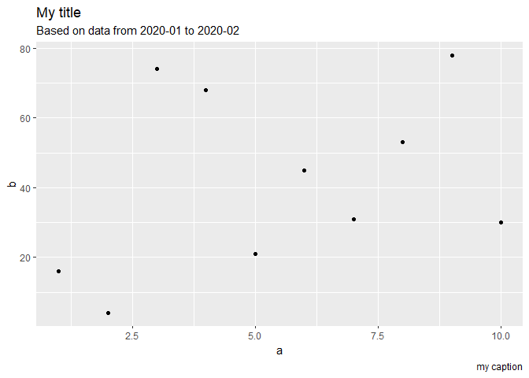

---
params:
  jira: "HBRA-99"
  github: "github.com"
  confluence: "https://www.atlassian.com/software/confluence"
  title: "Are titles phrased as questions more engaging than statements?"
  #logo_url: "https://hbr.org/resources/css/images/HBR_logo_black.svg"
  accent_color: "#c82502"
  social_fill: "black"
title: 'Are titles phrased as questions more engaging than statements?'
author: "Authors" # 'VOLTRON'
date: '2020-05-29 21:53:42'
output: 
  html_document:
    code_folding: hide
    code_download: true
    df_print: paged
    keep_md: true
    toc: true
    toc_float: 
      collapsed: false
      smooth_scroll: false
---

<style>
@import url('https://fonts.googleapis.com/css?family=Source+Sans+Pro&display=swap');

body {font-family: "Source Sans Pro", sans-serif !important;}
h1, h2, h3, h4, h5 {font-weight: 700 !important; padding-top: 2rem;}
a {color: #c82502}
.author, .date {padding-top: 1rem;}
/*

/* ---- TOC ---- */
.list-group-item.active, .list-group-item.active:focus, .list-group-item.active:hover {background-color: #c82502; border-color: #c82502; margin-left: -2rem; padding-left: 2rem;}
.tocify, .nav-tabs > li > a {webkit-border-radius: unset; moz-border-radius: unset; border-radius: unset;}
.tocify::before {background-image: url(); margin-bottom: 2rem; display: inline-block; content: ""; width: 100%; height: 100px; background-size: 150px; background-position: center; background-repeat: no-repeat; display: none}
.tocify:nth-child(1) ul:nth-child(1)::before {content: "Are titles phrased as questions more engaging than statements?"; padding-left: .25rem; padding-right: .5rem; display: inline-block;}
.tocify ul li:first-of-type {margin-top: 1rem;}
.tocify {padding-top: 2rem; padding-bottom: 2rem;}
.tocify-header {text-indent: unset !important; padding-left: 2rem;}
ul.tocify-header {padding-left: 1rem;}
.nav-tabs {padding-top: 1rem;}

summary {padding: 1rem; border: 1px solid #abafb0;}

/* slide stuff */
.noselect {
  -webkit-touch-callout: none; /* iOS Safari */
    -webkit-user-select: none; /* Safari */
     -khtml-user-select: none; /* Konqueror HTML */
       -moz-user-select: none; /* Firefox */
        -ms-user-select: none; /* Internet Explorer/Edge */
            user-select: none; /* Non-prefixed version, currently
                                  supported by Chrome and Opera */
}

.nav-arrow { font-size: 30px; color: #c82502; background: white; cursor: pointer; display: block; text-align: center; border-radius: 30px; border: 1px solid lightgrey;}

.fixed-height { max-height: 400px !important; overflow: auto; }

.author, .date {
display: inline-block;
color: grey;
font-weight: normal !important;
}

.date {
padding-left: 3rem;
}

</style>

<script src="https://cdnjs.cloudflare.com/ajax/libs/mermaid/8.5.1/mermaid.min.js"></script>

## Background

This is my go-to template for work projects. I wanted a notebook with some minimal slide functionality without having to separate/commit whole hog to a separate ioslides output or whatever. Helps maintain flow. 

Don't want a dependency of a theme package, just plain ol HTML/CSS/JS

> Lorem ipsum dolor sit amet, consectetur adipiscing elit, sed do eiusmod tempor incididunt ut labore et dolore magna aliqua. Ut enim ad minim veniam, quis nostrud exercitation ullamco laboris nisi ut aliquip ex ea commodo consequat. Duis aute irure dolor in reprehenderit in voluptate velit esse cillum dolore eu fugiat nulla pariatur. Excepteur sint occaecat cupidatat non proident, sunt in culpa qui officia deserunt mollit anim id est laborum. [^1]


[^1]: footnote

### Plan {.tabset}

Gantt and ER don't work

#### Flowchart

```r
htmltools::HTML('
  <div class="mermaid">
  graph LR
      A --- B
      B-->C
      B-->D
  </div>
  ')
```

<!--html_preserve-->
  <div class="mermaid">
  graph LR
      A --- B
      B-->C
      B-->D
  </div>
  <!--/html_preserve-->

#### User Journey 

```r
htmltools::HTML('
  <div class="mermaid">
journey
    title My working day
    section Go to work
      Make tea: 5: Me
      Go upstairs: 3: Me
      Do work: 1: Me, Cat
    section Go home
      Go downstairs: 5: Me
      Sit down: 5: Me
  </div>
  ')
```

<!--html_preserve-->
  <div class="mermaid">
journey
    title My working day
    section Go to work
      Make tea: 5: Me
      Go upstairs: 3: Me
      Do work: 1: Me, Cat
    section Go home
      Go downstairs: 5: Me
      Sit down: 5: Me
  </div>
  <!--/html_preserve-->

#### Sequence Diagram

```r
htmltools::HTML('
  <div class="mermaid">
sequenceDiagram
    participant John
    participant Alice
    Alice->>John: Hello John, how are you?
    John-->>Alice: Great!
  </div>
  ')
```

<!--html_preserve-->
  <div class="mermaid">
sequenceDiagram
    participant John
    participant Alice
    Alice->>John: Hello John, how are you?
    John-->>Alice: Great!
  </div>
  <!--/html_preserve-->

## Work {.tabset}
Data cleaning and stuff

```js
var x = 10;
```

### a {.fixed-height}

```r
knitr::opts_chunk$set(echo = TRUE)
t(t(letters))
```

```
##       [,1]
##  [1,] "a" 
##  [2,] "b" 
##  [3,] "c" 
##  [4,] "d" 
##  [5,] "e" 
##  [6,] "f" 
##  [7,] "g" 
##  [8,] "h" 
##  [9,] "i" 
## [10,] "j" 
## [11,] "k" 
## [12,] "l" 
## [13,] "m" 
## [14,] "n" 
## [15,] "o" 
## [16,] "p" 
## [17,] "q" 
## [18,] "r" 
## [19,] "s" 
## [20,] "t" 
## [21,] "u" 
## [22,] "v" 
## [23,] "w" 
## [24,] "x" 
## [25,] "y" 
## [26,] "z"
```

### b {.fixed-height}

```r
knitr::opts_chunk$set(echo = TRUE)
letters
```

```
##  [1] "a" "b" "c" "d" "e" "f" "g" "h" "i" "j" "k" "l" "m" "n" "o" "p" "q"
## [18] "r" "s" "t" "u" "v" "w" "x" "y" "z"
```


## Findings/Recommendations {.tabset}
This section can function as slides if there's not too much to show. See "Slides" for slides within a tab.

### Revenue is up!


```r
mtcars
```

<div data-pagedtable="false">
  <script data-pagedtable-source type="application/json">
{"columns":[{"label":[""],"name":["_rn_"],"type":[""],"align":["left"]},{"label":["mpg"],"name":[1],"type":["dbl"],"align":["right"]},{"label":["cyl"],"name":[2],"type":["dbl"],"align":["right"]},{"label":["disp"],"name":[3],"type":["dbl"],"align":["right"]},{"label":["hp"],"name":[4],"type":["dbl"],"align":["right"]},{"label":["drat"],"name":[5],"type":["dbl"],"align":["right"]},{"label":["wt"],"name":[6],"type":["dbl"],"align":["right"]},{"label":["qsec"],"name":[7],"type":["dbl"],"align":["right"]},{"label":["vs"],"name":[8],"type":["dbl"],"align":["right"]},{"label":["am"],"name":[9],"type":["dbl"],"align":["right"]},{"label":["gear"],"name":[10],"type":["dbl"],"align":["right"]},{"label":["carb"],"name":[11],"type":["dbl"],"align":["right"]}],"data":[{"1":"21.0","2":"6","3":"160.0","4":"110","5":"3.90","6":"2.620","7":"16.46","8":"0","9":"1","10":"4","11":"4","_rn_":"Mazda RX4"},{"1":"21.0","2":"6","3":"160.0","4":"110","5":"3.90","6":"2.875","7":"17.02","8":"0","9":"1","10":"4","11":"4","_rn_":"Mazda RX4 Wag"},{"1":"22.8","2":"4","3":"108.0","4":"93","5":"3.85","6":"2.320","7":"18.61","8":"1","9":"1","10":"4","11":"1","_rn_":"Datsun 710"},{"1":"21.4","2":"6","3":"258.0","4":"110","5":"3.08","6":"3.215","7":"19.44","8":"1","9":"0","10":"3","11":"1","_rn_":"Hornet 4 Drive"},{"1":"18.7","2":"8","3":"360.0","4":"175","5":"3.15","6":"3.440","7":"17.02","8":"0","9":"0","10":"3","11":"2","_rn_":"Hornet Sportabout"},{"1":"18.1","2":"6","3":"225.0","4":"105","5":"2.76","6":"3.460","7":"20.22","8":"1","9":"0","10":"3","11":"1","_rn_":"Valiant"},{"1":"14.3","2":"8","3":"360.0","4":"245","5":"3.21","6":"3.570","7":"15.84","8":"0","9":"0","10":"3","11":"4","_rn_":"Duster 360"},{"1":"24.4","2":"4","3":"146.7","4":"62","5":"3.69","6":"3.190","7":"20.00","8":"1","9":"0","10":"4","11":"2","_rn_":"Merc 240D"},{"1":"22.8","2":"4","3":"140.8","4":"95","5":"3.92","6":"3.150","7":"22.90","8":"1","9":"0","10":"4","11":"2","_rn_":"Merc 230"},{"1":"19.2","2":"6","3":"167.6","4":"123","5":"3.92","6":"3.440","7":"18.30","8":"1","9":"0","10":"4","11":"4","_rn_":"Merc 280"},{"1":"17.8","2":"6","3":"167.6","4":"123","5":"3.92","6":"3.440","7":"18.90","8":"1","9":"0","10":"4","11":"4","_rn_":"Merc 280C"},{"1":"16.4","2":"8","3":"275.8","4":"180","5":"3.07","6":"4.070","7":"17.40","8":"0","9":"0","10":"3","11":"3","_rn_":"Merc 450SE"},{"1":"17.3","2":"8","3":"275.8","4":"180","5":"3.07","6":"3.730","7":"17.60","8":"0","9":"0","10":"3","11":"3","_rn_":"Merc 450SL"},{"1":"15.2","2":"8","3":"275.8","4":"180","5":"3.07","6":"3.780","7":"18.00","8":"0","9":"0","10":"3","11":"3","_rn_":"Merc 450SLC"},{"1":"10.4","2":"8","3":"472.0","4":"205","5":"2.93","6":"5.250","7":"17.98","8":"0","9":"0","10":"3","11":"4","_rn_":"Cadillac Fleetwood"},{"1":"10.4","2":"8","3":"460.0","4":"215","5":"3.00","6":"5.424","7":"17.82","8":"0","9":"0","10":"3","11":"4","_rn_":"Lincoln Continental"},{"1":"14.7","2":"8","3":"440.0","4":"230","5":"3.23","6":"5.345","7":"17.42","8":"0","9":"0","10":"3","11":"4","_rn_":"Chrysler Imperial"},{"1":"32.4","2":"4","3":"78.7","4":"66","5":"4.08","6":"2.200","7":"19.47","8":"1","9":"1","10":"4","11":"1","_rn_":"Fiat 128"},{"1":"30.4","2":"4","3":"75.7","4":"52","5":"4.93","6":"1.615","7":"18.52","8":"1","9":"1","10":"4","11":"2","_rn_":"Honda Civic"},{"1":"33.9","2":"4","3":"71.1","4":"65","5":"4.22","6":"1.835","7":"19.90","8":"1","9":"1","10":"4","11":"1","_rn_":"Toyota Corolla"},{"1":"21.5","2":"4","3":"120.1","4":"97","5":"3.70","6":"2.465","7":"20.01","8":"1","9":"0","10":"3","11":"1","_rn_":"Toyota Corona"},{"1":"15.5","2":"8","3":"318.0","4":"150","5":"2.76","6":"3.520","7":"16.87","8":"0","9":"0","10":"3","11":"2","_rn_":"Dodge Challenger"},{"1":"15.2","2":"8","3":"304.0","4":"150","5":"3.15","6":"3.435","7":"17.30","8":"0","9":"0","10":"3","11":"2","_rn_":"AMC Javelin"},{"1":"13.3","2":"8","3":"350.0","4":"245","5":"3.73","6":"3.840","7":"15.41","8":"0","9":"0","10":"3","11":"4","_rn_":"Camaro Z28"},{"1":"19.2","2":"8","3":"400.0","4":"175","5":"3.08","6":"3.845","7":"17.05","8":"0","9":"0","10":"3","11":"2","_rn_":"Pontiac Firebird"},{"1":"27.3","2":"4","3":"79.0","4":"66","5":"4.08","6":"1.935","7":"18.90","8":"1","9":"1","10":"4","11":"1","_rn_":"Fiat X1-9"},{"1":"26.0","2":"4","3":"120.3","4":"91","5":"4.43","6":"2.140","7":"16.70","8":"0","9":"1","10":"5","11":"2","_rn_":"Porsche 914-2"},{"1":"30.4","2":"4","3":"95.1","4":"113","5":"3.77","6":"1.513","7":"16.90","8":"1","9":"1","10":"5","11":"2","_rn_":"Lotus Europa"},{"1":"15.8","2":"8","3":"351.0","4":"264","5":"4.22","6":"3.170","7":"14.50","8":"0","9":"1","10":"5","11":"4","_rn_":"Ford Pantera L"},{"1":"19.7","2":"6","3":"145.0","4":"175","5":"3.62","6":"2.770","7":"15.50","8":"0","9":"1","10":"5","11":"6","_rn_":"Ferrari Dino"},{"1":"15.0","2":"8","3":"301.0","4":"335","5":"3.54","6":"3.570","7":"14.60","8":"0","9":"1","10":"5","11":"8","_rn_":"Maserati Bora"},{"1":"21.4","2":"4","3":"121.0","4":"109","5":"4.11","6":"2.780","7":"18.60","8":"1","9":"1","10":"4","11":"2","_rn_":"Volvo 142E"}],"options":{"columns":{"min":{},"max":[3]},"rows":{"min":[5],"max":[5]},"pages":{}}}
  </script>
</div>

### Except on Mars!


### Slides {.tabset .tabnav}
Can't link to these

<div style="width: 100% !important; padding: 1rem;">
<button class="nav-arrow noselect" style="float:left; width: 50%;" onclick="goBackward()">⟵</button>

<button class="nav-arrow noselect" style="width: 50%;" onclick="goForward()">⟶</button>

</div>

#### 1 
As you can see here, the results speak for themselves. 
<!-- -->

#### 2
As you can see here, the results speak for themselves. 
<!--html_preserve--><div id="htmlwidget-7e0792de0d6ac277f770" style="width:100%;height:480px;" class="plotly html-widget"></div>
<script type="application/json" data-for="htmlwidget-7e0792de0d6ac277f770">{"x":{"data":[{"x":[1,2,3,4,5,6,7,8,9,10],"y":[1,44,35,91,12,97,81,79,65,18],"text":["a:  1<br />b:  1","a:  2<br />b: 44","a:  3<br />b: 35","a:  4<br />b: 91","a:  5<br />b: 12","a:  6<br />b: 97","a:  7<br />b: 81","a:  8<br />b: 79","a:  9<br />b: 65","a: 10<br />b: 18"],"type":"scatter","mode":"markers","marker":{"autocolorscale":false,"color":"rgba(0,0,0,1)","opacity":1,"size":5.66929133858268,"symbol":"circle","line":{"width":1.88976377952756,"color":"rgba(0,0,0,1)"}},"hoveron":"points","showlegend":false,"xaxis":"x","yaxis":"y","hoverinfo":"text","frame":null}],"layout":{"margin":{"t":43.7625570776256,"r":7.30593607305936,"b":40.1826484018265,"l":43.1050228310502},"plot_bgcolor":"rgba(235,235,235,1)","paper_bgcolor":"rgba(255,255,255,1)","font":{"color":"rgba(0,0,0,1)","family":"","size":14.6118721461187},"title":"My title<br><sup>Based on data from 2020-01 to 2020-02<\/sup>","titlefont":{"color":"rgba(0,0,0,1)","family":"","size":17.5342465753425},"xaxis":{"domain":[0,1],"automargin":true,"type":"linear","autorange":false,"range":[0.55,10.45],"tickmode":"array","ticktext":["2.5","5.0","7.5","10.0"],"tickvals":[2.5,5,7.5,10],"categoryorder":"array","categoryarray":["2.5","5.0","7.5","10.0"],"nticks":null,"ticks":"outside","tickcolor":"rgba(51,51,51,1)","ticklen":3.65296803652968,"tickwidth":0.66417600664176,"showticklabels":true,"tickfont":{"color":"rgba(77,77,77,1)","family":"","size":11.689497716895},"tickangle":-0,"showline":false,"linecolor":null,"linewidth":0,"showgrid":true,"gridcolor":"rgba(255,255,255,1)","gridwidth":0.66417600664176,"zeroline":false,"anchor":"y","title":"a","titlefont":{"color":"rgba(0,0,0,1)","family":"","size":14.6118721461187},"hoverformat":".2f"},"yaxis":{"domain":[0,1],"automargin":true,"type":"linear","autorange":false,"range":[-3.8,101.8],"tickmode":"array","ticktext":["0","25","50","75","100"],"tickvals":[0,25,50,75,100],"categoryorder":"array","categoryarray":["0","25","50","75","100"],"nticks":null,"ticks":"outside","tickcolor":"rgba(51,51,51,1)","ticklen":3.65296803652968,"tickwidth":0.66417600664176,"showticklabels":true,"tickfont":{"color":"rgba(77,77,77,1)","family":"","size":11.689497716895},"tickangle":-0,"showline":false,"linecolor":null,"linewidth":0,"showgrid":true,"gridcolor":"rgba(255,255,255,1)","gridwidth":0.66417600664176,"zeroline":false,"anchor":"x","title":"b","titlefont":{"color":"rgba(0,0,0,1)","family":"","size":14.6118721461187},"hoverformat":".2f"},"shapes":[{"type":"rect","fillcolor":null,"line":{"color":null,"width":0,"linetype":[]},"yref":"paper","xref":"paper","x0":0,"x1":1,"y0":0,"y1":1}],"showlegend":false,"legend":{"bgcolor":"rgba(255,255,255,1)","bordercolor":"transparent","borderwidth":1.88976377952756,"font":{"color":"rgba(0,0,0,1)","family":"","size":11.689497716895}},"hovermode":"closest","barmode":"relative"},"config":{"doubleClick":"reset","modeBarButtonsToAdd":[{"name":"Collaborate","icon":{"width":1000,"ascent":500,"descent":-50,"path":"M487 375c7-10 9-23 5-36l-79-259c-3-12-11-23-22-31-11-8-22-12-35-12l-263 0c-15 0-29 5-43 15-13 10-23 23-28 37-5 13-5 25-1 37 0 0 0 3 1 7 1 5 1 8 1 11 0 2 0 4-1 6 0 3-1 5-1 6 1 2 2 4 3 6 1 2 2 4 4 6 2 3 4 5 5 7 5 7 9 16 13 26 4 10 7 19 9 26 0 2 0 5 0 9-1 4-1 6 0 8 0 2 2 5 4 8 3 3 5 5 5 7 4 6 8 15 12 26 4 11 7 19 7 26 1 1 0 4 0 9-1 4-1 7 0 8 1 2 3 5 6 8 4 4 6 6 6 7 4 5 8 13 13 24 4 11 7 20 7 28 1 1 0 4 0 7-1 3-1 6-1 7 0 2 1 4 3 6 1 1 3 4 5 6 2 3 3 5 5 6 1 2 3 5 4 9 2 3 3 7 5 10 1 3 2 6 4 10 2 4 4 7 6 9 2 3 4 5 7 7 3 2 7 3 11 3 3 0 8 0 13-1l0-1c7 2 12 2 14 2l218 0c14 0 25-5 32-16 8-10 10-23 6-37l-79-259c-7-22-13-37-20-43-7-7-19-10-37-10l-248 0c-5 0-9-2-11-5-2-3-2-7 0-12 4-13 18-20 41-20l264 0c5 0 10 2 16 5 5 3 8 6 10 11l85 282c2 5 2 10 2 17 7-3 13-7 17-13z m-304 0c-1-3-1-5 0-7 1-1 3-2 6-2l174 0c2 0 4 1 7 2 2 2 4 4 5 7l6 18c0 3 0 5-1 7-1 1-3 2-6 2l-173 0c-3 0-5-1-8-2-2-2-4-4-4-7z m-24-73c-1-3-1-5 0-7 2-2 3-2 6-2l174 0c2 0 5 0 7 2 3 2 4 4 5 7l6 18c1 2 0 5-1 6-1 2-3 3-5 3l-174 0c-3 0-5-1-7-3-3-1-4-4-5-6z"},"click":"function(gd) { \n        // is this being viewed in RStudio?\n        if (location.search == '?viewer_pane=1') {\n          alert('To learn about plotly for collaboration, visit:\\n https://cpsievert.github.io/plotly_book/plot-ly-for-collaboration.html');\n        } else {\n          window.open('https://cpsievert.github.io/plotly_book/plot-ly-for-collaboration.html', '_blank');\n        }\n      }"}],"cloud":false},"source":"A","attrs":{"2aa0198c72d6":{"x":{},"y":{},"type":"scatter"}},"cur_data":"2aa0198c72d6","visdat":{"2aa0198c72d6":["function (y) ","x"]},"highlight":{"on":"plotly_click","persistent":false,"dynamic":false,"selectize":false,"opacityDim":0.2,"selected":{"opacity":1},"debounce":0},"base_url":"https://plot.ly"},"evals":["config.modeBarButtonsToAdd.0.click"],"jsHooks":[]}</script><!--/html_preserve-->

#### 3
As you can see here, the results speak for themselves. 
<!--html_preserve--><div id="htmlwidget-e269232918070ba7e2e1" style="width:100%;height:480px;" class="plotly html-widget"></div>
<script type="application/json" data-for="htmlwidget-e269232918070ba7e2e1">{"x":{"data":[{"x":[1,2,3,4,5,6,7,8,9,10],"y":[50,3,56,85,6,40,72,44,89,95],"text":["a:  1<br />b: 50","a:  2<br />b:  3","a:  3<br />b: 56","a:  4<br />b: 85","a:  5<br />b:  6","a:  6<br />b: 40","a:  7<br />b: 72","a:  8<br />b: 44","a:  9<br />b: 89","a: 10<br />b: 95"],"type":"scatter","mode":"markers","marker":{"autocolorscale":false,"color":"rgba(0,0,0,1)","opacity":1,"size":5.66929133858268,"symbol":"circle","line":{"width":1.88976377952756,"color":"rgba(0,0,0,1)"}},"hoveron":"points","showlegend":false,"xaxis":"x","yaxis":"y","hoverinfo":"text","frame":null}],"layout":{"margin":{"t":26.2283105022831,"r":7.30593607305936,"b":40.1826484018265,"l":37.2602739726027},"plot_bgcolor":"rgba(235,235,235,1)","paper_bgcolor":"rgba(255,255,255,1)","font":{"color":"rgba(0,0,0,1)","family":"","size":14.6118721461187},"xaxis":{"domain":[0,1],"automargin":true,"type":"linear","autorange":false,"range":[0.55,10.45],"tickmode":"array","ticktext":["2.5","5.0","7.5","10.0"],"tickvals":[2.5,5,7.5,10],"categoryorder":"array","categoryarray":["2.5","5.0","7.5","10.0"],"nticks":null,"ticks":"outside","tickcolor":"rgba(51,51,51,1)","ticklen":3.65296803652968,"tickwidth":0.66417600664176,"showticklabels":true,"tickfont":{"color":"rgba(77,77,77,1)","family":"","size":11.689497716895},"tickangle":-0,"showline":false,"linecolor":null,"linewidth":0,"showgrid":true,"gridcolor":"rgba(255,255,255,1)","gridwidth":0.66417600664176,"zeroline":false,"anchor":"y","title":"a","titlefont":{"color":"rgba(0,0,0,1)","family":"","size":14.6118721461187},"hoverformat":".2f"},"yaxis":{"domain":[0,1],"automargin":true,"type":"linear","autorange":false,"range":[-1.6,99.6],"tickmode":"array","ticktext":["0","25","50","75"],"tickvals":[-2.22044604925031e-016,25,50,75],"categoryorder":"array","categoryarray":["0","25","50","75"],"nticks":null,"ticks":"outside","tickcolor":"rgba(51,51,51,1)","ticklen":3.65296803652968,"tickwidth":0.66417600664176,"showticklabels":true,"tickfont":{"color":"rgba(77,77,77,1)","family":"","size":11.689497716895},"tickangle":-0,"showline":false,"linecolor":null,"linewidth":0,"showgrid":true,"gridcolor":"rgba(255,255,255,1)","gridwidth":0.66417600664176,"zeroline":false,"anchor":"x","title":"b","titlefont":{"color":"rgba(0,0,0,1)","family":"","size":14.6118721461187},"hoverformat":".2f"},"shapes":[{"type":"rect","fillcolor":null,"line":{"color":null,"width":0,"linetype":[]},"yref":"paper","xref":"paper","x0":0,"x1":1,"y0":0,"y1":1}],"showlegend":false,"legend":{"bgcolor":"rgba(255,255,255,1)","bordercolor":"transparent","borderwidth":1.88976377952756,"font":{"color":"rgba(0,0,0,1)","family":"","size":11.689497716895}},"hovermode":"closest","barmode":"relative"},"config":{"doubleClick":"reset","modeBarButtonsToAdd":[{"name":"Collaborate","icon":{"width":1000,"ascent":500,"descent":-50,"path":"M487 375c7-10 9-23 5-36l-79-259c-3-12-11-23-22-31-11-8-22-12-35-12l-263 0c-15 0-29 5-43 15-13 10-23 23-28 37-5 13-5 25-1 37 0 0 0 3 1 7 1 5 1 8 1 11 0 2 0 4-1 6 0 3-1 5-1 6 1 2 2 4 3 6 1 2 2 4 4 6 2 3 4 5 5 7 5 7 9 16 13 26 4 10 7 19 9 26 0 2 0 5 0 9-1 4-1 6 0 8 0 2 2 5 4 8 3 3 5 5 5 7 4 6 8 15 12 26 4 11 7 19 7 26 1 1 0 4 0 9-1 4-1 7 0 8 1 2 3 5 6 8 4 4 6 6 6 7 4 5 8 13 13 24 4 11 7 20 7 28 1 1 0 4 0 7-1 3-1 6-1 7 0 2 1 4 3 6 1 1 3 4 5 6 2 3 3 5 5 6 1 2 3 5 4 9 2 3 3 7 5 10 1 3 2 6 4 10 2 4 4 7 6 9 2 3 4 5 7 7 3 2 7 3 11 3 3 0 8 0 13-1l0-1c7 2 12 2 14 2l218 0c14 0 25-5 32-16 8-10 10-23 6-37l-79-259c-7-22-13-37-20-43-7-7-19-10-37-10l-248 0c-5 0-9-2-11-5-2-3-2-7 0-12 4-13 18-20 41-20l264 0c5 0 10 2 16 5 5 3 8 6 10 11l85 282c2 5 2 10 2 17 7-3 13-7 17-13z m-304 0c-1-3-1-5 0-7 1-1 3-2 6-2l174 0c2 0 4 1 7 2 2 2 4 4 5 7l6 18c0 3 0 5-1 7-1 1-3 2-6 2l-173 0c-3 0-5-1-8-2-2-2-4-4-4-7z m-24-73c-1-3-1-5 0-7 2-2 3-2 6-2l174 0c2 0 5 0 7 2 3 2 4 4 5 7l6 18c1 2 0 5-1 6-1 2-3 3-5 3l-174 0c-3 0-5-1-7-3-3-1-4-4-5-6z"},"click":"function(gd) { \n        // is this being viewed in RStudio?\n        if (location.search == '?viewer_pane=1') {\n          alert('To learn about plotly for collaboration, visit:\\n https://cpsievert.github.io/plotly_book/plot-ly-for-collaboration.html');\n        } else {\n          window.open('https://cpsievert.github.io/plotly_book/plot-ly-for-collaboration.html', '_blank');\n        }\n      }"}],"cloud":false},"source":"A","attrs":{"2aa074a2b18":{"x":{},"y":{},"type":"scatter"}},"cur_data":"2aa074a2b18","visdat":{"2aa074a2b18":["function (y) ","x"]},"highlight":{"on":"plotly_click","persistent":false,"dynamic":false,"selectize":false,"opacityDim":0.2,"selected":{"opacity":1},"debounce":0},"base_url":"https://plot.ly"},"evals":["config.modeBarButtonsToAdd.0.click"],"jsHooks":[]}</script><!--/html_preserve-->


---

## Appendix

This is an R Markdown document. Markdown is a simple formatting syntax for authoring HTML, PDF, and MS Word documents. For more details on using R Markdown see <http://rmarkdown.rstudio.com>.

<details><summary>R Session Info</summary>


```r
sessionInfo()
```

```
## R version 3.5.1 (2018-07-02)
## Platform: x86_64-w64-mingw32/x64 (64-bit)
## Running under: Windows 10 x64 (build 18362)
## 
## Matrix products: default
## 
## locale:
## [1] LC_COLLATE=English_United States.1252 
## [2] LC_CTYPE=English_United States.1252   
## [3] LC_MONETARY=English_United States.1252
## [4] LC_NUMERIC=C                          
## [5] LC_TIME=English_United States.1252    
## 
## attached base packages:
## [1] stats     graphics  grDevices utils     datasets  methods   base     
## 
## other attached packages:
## [1] glue_1.3.0    dplyr_0.8.5   plotly_4.8.0  ggplot2_3.1.0
## 
## loaded via a namespace (and not attached):
##  [1] Rcpp_1.0.4           later_1.0.0          pillar_1.3.1        
##  [4] compiler_3.5.1       plyr_1.8.4           base64enc_0.1-3     
##  [7] tools_3.5.1          digest_0.6.25        viridisLite_0.3.0   
## [10] jsonlite_1.5         evaluate_0.14        tibble_2.0.1        
## [13] gtable_0.2.0         pkgconfig_2.0.2      rlang_0.4.5         
## [16] shiny_1.4.0.2        crosstalk_1.0.0      yaml_2.2.0          
## [19] xfun_0.8             fastmap_1.0.1        withr_2.1.2         
## [22] stringr_1.4.0        httr_1.4.0           knitr_1.23          
## [25] htmlwidgets_1.5.1    grid_3.5.1           tidyselect_0.2.5    
## [28] data.table_1.12.2    R6_2.3.0             rmarkdown_1.13      
## [31] tidyr_0.8.2          purrr_0.2.5          magrittr_1.5        
## [34] promises_1.1.0       scales_1.0.0         htmltools_0.4.0.9003
## [37] assertthat_0.2.0     xtable_1.8-3         mime_0.6            
## [40] colorspace_1.4-0     httpuv_1.5.2         labeling_0.3        
## [43] stringi_1.2.4        lazyeval_0.2.1       munsell_0.5.0       
## [46] crayon_1.3.4
```

</details>

<style>
.footnotes hr {display: none;}
</style>

## Footnotes


```r
library(fontawesome)
links <- sapply(c("github", "twitter", "linkedin"), fa, fill=params$social_fill) %>%
  paste(collapse="")

links <- gsub("<svg", "<a href='https://hbr.org'><svg", links)
links <- gsub("</svg", "</svg></a", links)

links <- sub("hbr.org", "github.com", links)
links <- sub("hbr.org", "twitter.com", links)
links <- sub("hbr.org", "linkedin.com", links)
```

<style>
[id*="tocify-header"]:last-of-type {
font-size: 3rem;
cursor: unset;
letter-spacing: 2rem;
}
a svg:hover {
font-size: 120% !important;
}
#social-links {display:none;}
</style>

## <a href='https://github.com'><svg style="height:0.8em;top:.04em;position:relative;fill:black;" viewBox="0 0 496 512"><path d="M165.9 397.4c0 2-2.3 3.6-5.2 3.6-3.3.3-5.6-1.3-5.6-3.6 0-2 2.3-3.6 5.2-3.6 3-.3 5.6 1.3 5.6 3.6zm-31.1-4.5c-.7 2 1.3 4.3 4.3 4.9 2.6 1 5.6 0 6.2-2s-1.3-4.3-4.3-5.2c-2.6-.7-5.5.3-6.2 2.3zm44.2-1.7c-2.9.7-4.9 2.6-4.6 4.9.3 2 2.9 3.3 5.9 2.6 2.9-.7 4.9-2.6 4.6-4.6-.3-1.9-3-3.2-5.9-2.9zM244.8 8C106.1 8 0 113.3 0 252c0 110.9 69.8 205.8 169.5 239.2 12.8 2.3 17.3-5.6 17.3-12.1 0-6.2-.3-40.4-.3-61.4 0 0-70 15-84.7-29.8 0 0-11.4-29.1-27.8-36.6 0 0-22.9-15.7 1.6-15.4 0 0 24.9 2 38.6 25.8 21.9 38.6 58.6 27.5 72.9 20.9 2.3-16 8.8-27.1 16-33.7-55.9-6.2-112.3-14.3-112.3-110.5 0-27.5 7.6-41.3 23.6-58.9-2.6-6.5-11.1-33.3 2.6-67.9 20.9-6.5 69 27 69 27 20-5.6 41.5-8.5 62.8-8.5s42.8 2.9 62.8 8.5c0 0 48.1-33.6 69-27 13.7 34.7 5.2 61.4 2.6 67.9 16 17.7 25.8 31.5 25.8 58.9 0 96.5-58.9 104.2-114.8 110.5 9.2 7.9 17 22.9 17 46.4 0 33.7-.3 75.4-.3 83.6 0 6.5 4.6 14.4 17.3 12.1C428.2 457.8 496 362.9 496 252 496 113.3 383.5 8 244.8 8zM97.2 352.9c-1.3 1-1 3.3.7 5.2 1.6 1.6 3.9 2.3 5.2 1 1.3-1 1-3.3-.7-5.2-1.6-1.6-3.9-2.3-5.2-1zm-10.8-8.1c-.7 1.3.3 2.9 2.3 3.9 1.6 1 3.6.7 4.3-.7.7-1.3-.3-2.9-2.3-3.9-2-.6-3.6-.3-4.3.7zm32.4 35.6c-1.6 1.3-1 4.3 1.3 6.2 2.3 2.3 5.2 2.6 6.5 1 1.3-1.3.7-4.3-1.3-6.2-2.2-2.3-5.2-2.6-6.5-1zm-11.4-14.7c-1.6 1-1.6 3.6 0 5.9 1.6 2.3 4.3 3.3 5.6 2.3 1.6-1.3 1.6-3.9 0-6.2-1.4-2.3-4-3.3-5.6-2z"/></svg></a><a href='https://twitter.com'><svg style="height:0.8em;top:.04em;position:relative;fill:black;" viewBox="0 0 512 512"><path d="M459.37 151.716c.325 4.548.325 9.097.325 13.645 0 138.72-105.583 298.558-298.558 298.558-59.452 0-114.68-17.219-161.137-47.106 8.447.974 16.568 1.299 25.34 1.299 49.055 0 94.213-16.568 130.274-44.832-46.132-.975-84.792-31.188-98.112-72.772 6.498.974 12.995 1.624 19.818 1.624 9.421 0 18.843-1.3 27.614-3.573-48.081-9.747-84.143-51.98-84.143-102.985v-1.299c13.969 7.797 30.214 12.67 47.431 13.319-28.264-18.843-46.781-51.005-46.781-87.391 0-19.492 5.197-37.36 14.294-52.954 51.655 63.675 129.3 105.258 216.365 109.807-1.624-7.797-2.599-15.918-2.599-24.04 0-57.828 46.782-104.934 104.934-104.934 30.213 0 57.502 12.67 76.67 33.137 23.715-4.548 46.456-13.32 66.599-25.34-7.798 24.366-24.366 44.833-46.132 57.827 21.117-2.273 41.584-8.122 60.426-16.243-14.292 20.791-32.161 39.308-52.628 54.253z"/></svg></a><a href='https://linkedin.com'><svg style="height:0.8em;top:.04em;position:relative;fill:black;" viewBox="0 0 448 512"><path d="M416 32H31.9C14.3 32 0 46.5 0 64.3v383.4C0 465.5 14.3 480 31.9 480H416c17.6 0 32-14.5 32-32.3V64.3c0-17.8-14.4-32.3-32-32.3zM135.4 416H69V202.2h66.5V416zm-33.2-243c-21.3 0-38.5-17.3-38.5-38.5S80.9 96 102.2 96c21.2 0 38.5 17.3 38.5 38.5 0 21.3-17.2 38.5-38.5 38.5zm282.1 243h-66.4V312c0-24.8-.5-56.7-34.5-56.7-34.6 0-39.9 27-39.9 54.9V416h-66.4V202.2h63.7v29.2h.9c8.9-16.8 30.6-34.5 62.9-34.5 67.2 0 79.7 44.3 79.7 101.9V416z"/></svg></a> {#social-links}

<script>
var config = {
    startOnLoad:true,
    flowchart:{
        useMaxWidth:false,
        htmlLabels:true
    }
};
mermaid.initialize(config);
    
function goBackward() {
  let previous = Array.from(document.querySelectorAll(".tabnav > ul.nav > li")).indexOf(document.querySelector(".tabnav > ul.nav > li.active"))-1;
  document.querySelectorAll(".tabnav > ul.nav > li > a")[previous].click()
};

function goForward() {
  document.querySelector(".tabnav > ul.nav > li.active + li > a").click();
};
</script>

